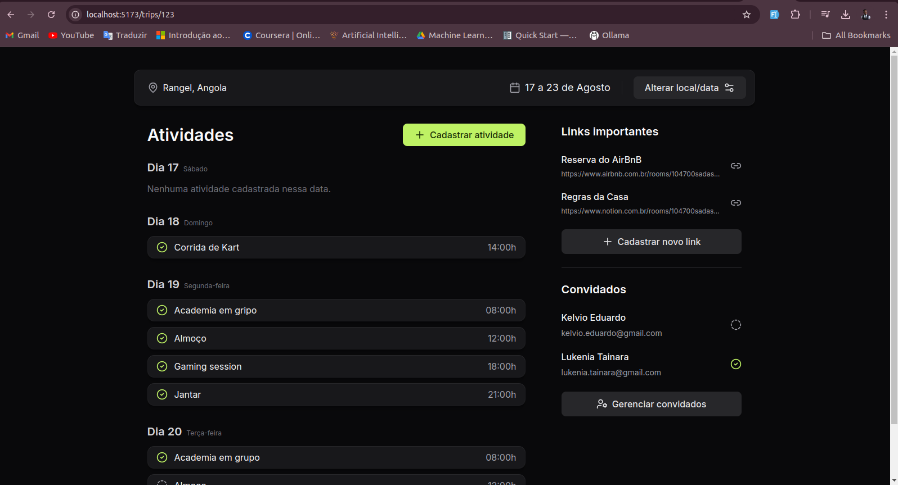
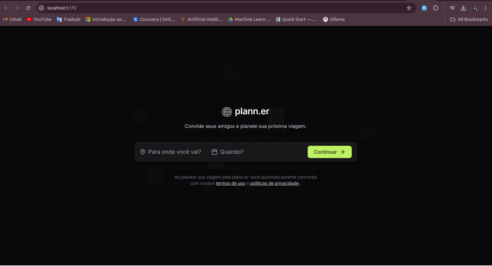
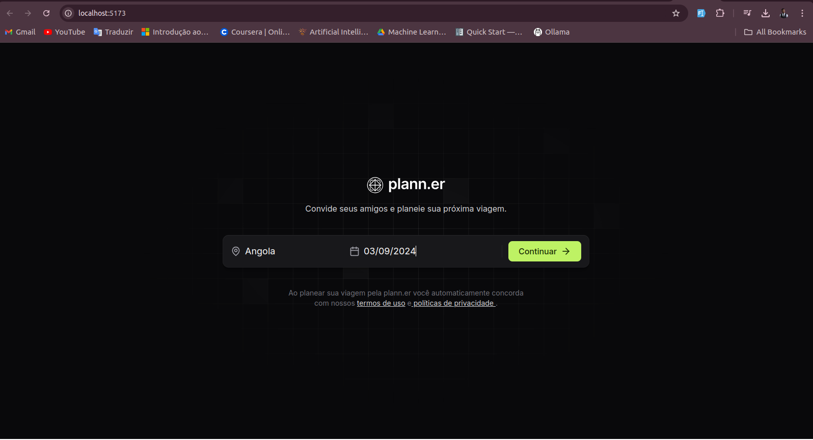
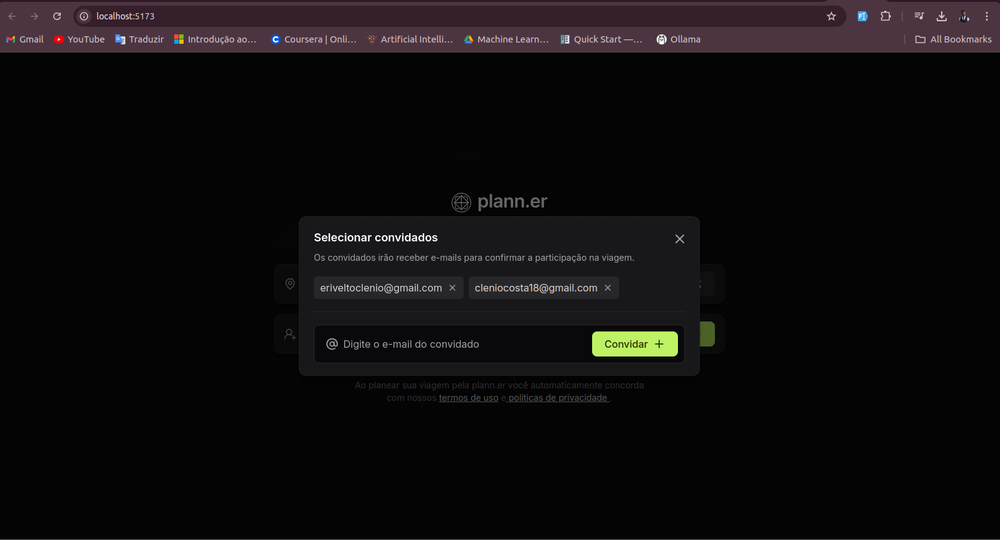
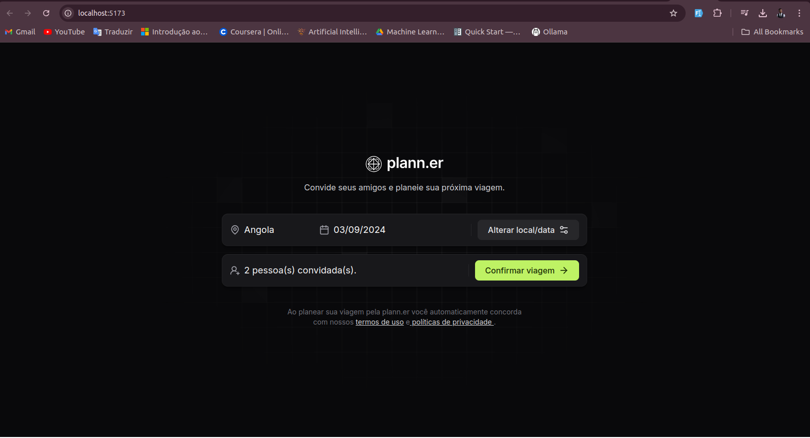
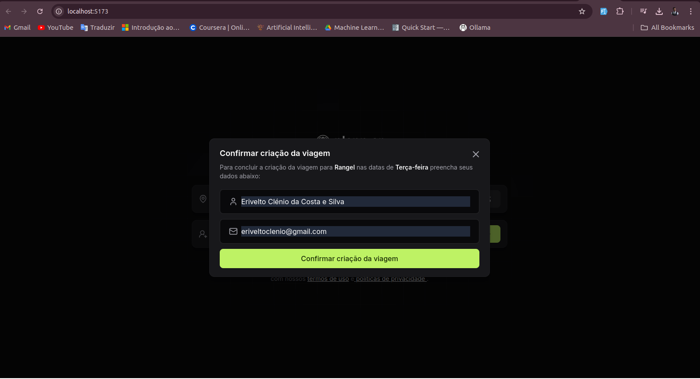

[TYPESCRIPT__BADGE]: https://img.shields.io/badge/typescript-D4FAFF?style=for-the-badge&logo=typescript
[TailwindCSS_BADGE]: https://img.shields.io/badge/tailwindcss-%2338B2AC.svg?style=for-the-badge&logo=tailwind-css&logoColor=white
[NEXT_BADGE]: https://img.shields.io/badge/Next-black?style=for-the-badge&logo=next.js&logoColor=white
[PROJECT__BADGE]: https://img.shields.io/badge/📱Visit_this_project-000?style=for-the-badge&logo=project
[PROJECT__URL]: https://portfolio-1f6u.vercel.app/
[VERCEL_BADGE]: https://img.shields.io/badge/vercel-%23000000.svg?style=for-the-badge&logo=vercel&logoColor=white
[REACT_BADGE]: https://img.shields.io/badge/react-%2320232a.svg?style=for-the-badge&logo=react&logoColor=%2361DAFB


<h1 align="center" style="font-weight: bold;">Plann.er  💻</h1>


![react][REACT_BADGE]
![typescript][TYPESCRIPT__BADGE]
![TailwindCss][TailwindCSS_BADGE]
![Vercel][VERCEL_BADGE]


`Content:`
<p align="center">
 <a href="#about">About</a>  • 
 <a href="#utilLinks">Utils Links</a>  • 
 <a href="#started">Getting Started</a> • 
 <a href="#prerequisites">Prerequisites</a> • 
 <a href="#howToRun">How To CLone & Run</a> • 
 <a href="#results">Results</a>  • 
 <a href="#contribute">Contributes</a>  • 
 <a href="#collaborators">Collaborators</a> • 
 <a href="#license">License</a> • 
</p>


<p align="center">
    
</p>

<h2 id="about">🧠 About</h2>

<p>
Created during Rocketseat’s Next Level Week, this project is an intuitive and visually appealing travel planner. Built with React, TypeScript, and Tailwind CSS, Plann.er offers a suite of features to help you organize your upcoming adventures.
</p>


<h2 id="utilLinks">🔗 Utils Links</h2>

1. <a href="https://www.figma.com/community/file/1392276515495389646">Frontend Figma</a>


<h2 id="started">🚀 Getting started</h2>

This section describes how to run the project locally.

<h3 id="prerequisites">Pre-requisites</h3>

Here you list all prerequisites necessary for running your project. For example:

- NodeJS
- npm
- TypeScript
- Git 


<h2 id="howToRun">🔗 How to Clone & Run</h2>

<h3>Cloning</h3>

- Clone the project repository from GitHub:

```bash
git clone https://github.com/EriveltoSilva/travel-planner-frontend.git
```
or in linux:
```bash
git clone git@github.com:EriveltoSilva/travel-planner-frontend.git
```

<h3>Running</h3>

- Navigate to the project directory:

```bash
cd travel-planner-frontend
```

- Install the required dependencies:
```bash
npm install
```

- Run the project:
```bash
npm run dev
```

<h2 id="results">📌 Results</h2>

<p align="center">
    
    
    
    
    
    
</p>

<h2 id="collaborators">🤝 Collaborators</h2>

Special thank you for all people that contributed for this project.

<table>
  <tr>
    <td align="center">
      <a href="#">
        <br>
        <sub>
          <b>Erivelto Silva</b>
        </sub>
      </a>
    </td>
  </tr>
</table>

<h2 id="license">📓 License</h2>

This project is licensed under the <a href="./LICENSE">MIT License</a>. See the LICENSE file for more information.